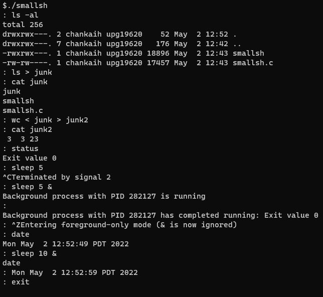

# Custom Shell

Custom shell that implements many features present in other shells such as bash.

## Shell Description & Functionality:

### Command Prompt

- `:` is the prompt symbol
- General syntax of command line: `command [arg1 arg2 ...] [< input_file] [> output_file] [&]`
  - Input redirection (`<`) can occur before or after output redirection (`>`)
  - A trailing `&` signifies that the command should be run in the background
- Supports command lines with a maximum length of 2048 characters and a maximum of 512 arguments
- Quotations, pipes, and error checking of syntax are not supported

### Comments

- Comment lines must begin with `#`

### Variable Expansion of `$$`

- An instance of `$$` in a command argument is expanded to the process ID of the shell itself

### Built-In Commands

These commands are run in foreground-only mode.

- `cd [path]`
  - Change current working directory
  - If no path is specified, the current working directory is changed to the HOME directory
- `exit`
  - Terminate all child processes and exit the shell
- `status`
  - Print the exit status or terminating signal of the last foreground process that ran a non-built-in command

### Other Commands

- Non-built-in commands are run using the exec() family of functions
- The shell will fork off a child to run the command, which then terminates after running the command
- If a command fails, an error message is printed and the exit status is set to 1

### Input & Output Redirection

- If the output file does not exist, it is created
- If the output file already exists, it is replaced
- If redirection fails, an error message is printed and the exit status is set to 1

### Foreground & Background Commands

- A trailing `&` in the command line signifies that the command should be run in the background
  - Command line access is returned immediately to the user while the command is run in the background
  - The shell prints the process ID of the background process when it begins
  - When a background process terminates, a termination message is printed with its process ID and exit status. This occurs immediately before the next prompt is displayed
- Foreground commands are run as normal and do not return command line access to the user until after the command finishes running

### SIGINT & SIGTSTP Signals

- SIGINT via Ctrl+C
  - Interrupts the current running foreground child process
  - The process ID of the interrupted foreground child process is printed
- SIGTSTP via Ctrl+Z
  - Enter or exit foreground-only mode. In this mode, all processes are run in the foreground

## Getting Started

### Dependencies

- Linux

### Installation

```gcc -std=c99 -o smallsh smallsh.c```

### Executing the Program

```./smallsh```

## Sample Run


